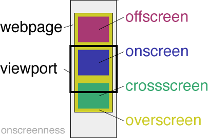

# onscreenness
Sign up your elements and a have their onscreen presence be assessed. 
With the html-classes and data offered here, your elements 
can make an grand entrance on the viewport!

## Sign up your elements
Once bundled in your project onScreenness is available as a global object.
You can sign up your elements for the onScreenness-treat using a CSS selector:

    let querySelector = '#myElement'
    onScreenness.collect(querySelector);
    onScreenness.collect('.paragraph');

The collect method may be called several times to build up the collection.

Elements covered by a query in the collection can be blacklisted with an alternative query:

    onScreenness.exclude('.paragraph.emphasis');
    onScreenness.exclude('#that-paragraph');

CSS selectors added to the collection can be removed:

    onScreenness.remove('#myElement');

All specified queries can be removed:

    onScreenness.reset();

## Automatic pick-up
Onscreenness will also watch the html for elements with a data attribute:

    <section data-onscreenness>...</section>

In this case no further scripting is needed. 
Blacklisting will also work on automatically picked up elements.
Resetting will work on such element when the collection contains a query capable of selecting it.

## Have the onscreen presence data
When the visible part of the webpage changes, the onscreenness of the collected elements is assesed.

Depending on the place the element has relative to the viewport, the element is assigned
a class 'onscreen', 'crossscreen' or 'offscreen'.

As some elements are too big to be assigned the 'onscreen' class, the 'overscreen' class was created.
The class 'overscreen' is assigned in two cases:
* The element covers the viewport in one aspect and is entirely visible in the other aspect.
* The element covers the viewport entirely
Appears together with 'crossscreen'.

### Styling and scripting

With stylerules you can now set the elements' appearance while it moves through the viewport, 
that's up to you.

Also, each involved element gets an 'onscreenness' and a 'overlapping' data attribute.
Onscreenness is the extent to which the element is inside the viewport.
Overlapping is the extent to which the element fills the viewport.
You could script on it.

The onscreenness properties are passed as the arguments:

    let myFunction = props => { 
        if ( props.surfacePresence > .75) {
            console.log('myElement has been visible to the user')
        }
    }
    onScreenness.collect('#myElement', myFunction);

When using a traditional function, the current element is exposed as 'this':

    let myFunction = function ( props ) { 
        if ( Number ( this.dataset['onscreenness'] ) > .75) {
            console.log(`${this.id} has been visible to the user`)
        }
    }
    onScreenness.collect('#myElement', myFunction);

[see  demo folder](./demo)

## ...

### Install for vanilla javascript-app
Place the following code in the head-section of your webpage:

    

### Triggers for assesment of presence
* readystatechange to interactive
* resize window
* scrolling
* document changes

### Application Programming Interface
[see API description](./API.md)

### Version History
[see changelog](./CHANGELOG.md)